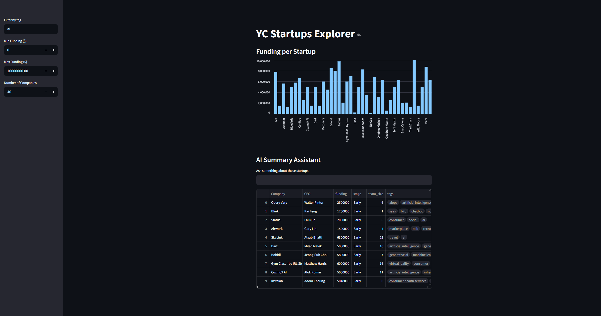

# YC Startup Intelligence Pipeline

A Python-based ETL pipeline to automatically collect, enrich, and analyze YC startup data. Provides structured insights via a Streamlit dashboard.

---



---

## About
The YC Startup Intelligence Pipeline automates the process of collecting and analyzing data on Y Combinator startups. The system scrapes company details, CEO information and profiles off of YC, then scrapes company funding search results and feeds them into an LLM to properly extract the funding 

This project is intended for **data analysis, research, and educational purposes**, and is not optimized for production use yet.

## Features
- **Automated Data Ingestion** - Scrapes YC startup data, cleans with Pandas, and loads to PostgreSQL every couple hours via Airflow  
- **LLM-Powered Funding Extractor** - Uses an LLM to parse unstructured funding data from search results.  
- **Analytics Dashboard** - Streamlit interface with filters, charts, and tables.  
- **Containerized Pipelines** - Dockerized services for easy local execution.  
- **Parallel Processing** - Uses threads to process multiple LLM responses efficiently, and perform a median aggregation.

## Tech Stack
- **Backend / Pipeline:** Python, FastAPI, Apache Airflow
- **Database:** PostgreSQL
- **Frontend / Dashboard:** Streamlit  
- **LLM:** Ollama (Llama 3, configurable)  
- **Infrastructure:** Docker  

## Usage

### Requirements
- Docker
- Ollama (only if you want ollama to use your machine instead of being in a container)

### Setup
1. Clone the repo:
```bash
git clone https://github.com/your-username/yc-data-pipeline.git
cd yc-data-pipeline
```

2. Set configurations in a .env file. You can use the .exmaple.env file for reference
   - You can freely change the LLM model, and you can configure to run Ollama on your machine instead (can be faster depending on your specs)
   - For the x_algolia_api_key variable, you can easily obtain one by going to YC yourself, and intercepting the API key via the network tab
   - You can leave the default postgres credentials as is
  
3. Run the following:
```bash
docker compose up
```
Thats it! Let it run for a while and you'll be able to interact with all the data on the streamlit dashboard on http://localhost:8501
   
